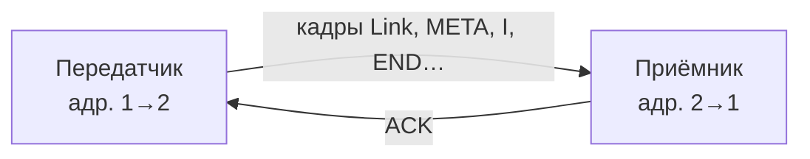
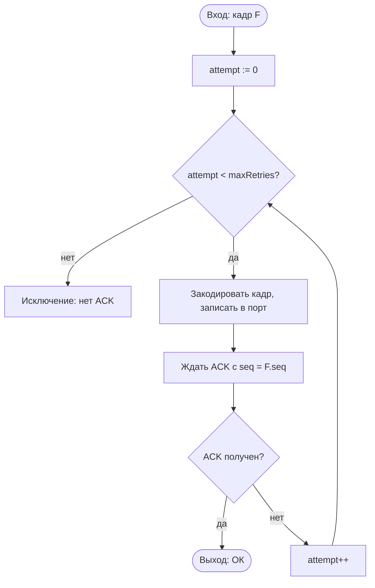

# Схемы алгоритмов (текстовое описание)

Программа пересылки текстовых файлов по RS-232 (канальный протокол, код **[15,11]**). Документ дублирует содержание графических схем из [`algorithm-schemes.html`](algorithm-schemes.html) в виде структурированного текста — удобно для пояснительной записки, репозитория и просмотра в Markdown.

**Условные обозначения (как на HTML-странице):**

| Цвет / тип | Смысл |
|------------|--------|
| Начало / конец | вход и выход алгоритма |
| Процесс | вычислительное действие |
| Условие | ветвление |
| Ввод-вывод / кадр | работа с портом, формирование или разбор кадра |

---

## 1. Общая схема взаимодействия узлов

Два логических узла связаны **дуплексным** физическим каналом **RS-232** (нуль-модем или виртуальная пара COM-портов, например `vcomA` ↔ `vcomB`).

- **Передатчик:** локальный адрес **1**, удалённый **2**; отправляет по прямому направлению канала кадры протокола (**Link**, **META**, информационные **I**, **END**, при необходимости другие типы).
- **Приёмник:** локальный адрес **2**, удалённый **1**; по обратному направлению возвращает кадры **ACK** с тем же номером **seq**, что и у подтверждаемого кадра.

**Порядок запуска:** сначала подключают приёмник, затем передатчик. Для кадров, передаваемых с надёжной доставкой, приёмник на каждый успешно принятый кадр отвечает **ACK** с соответствующим **seq**.

---

## 2. Алгоритм узла-передатчика (передача одного файла)

Последовательность шагов:

1. **Начало.**
2. Прочитать файл в память.
3. Установить **seq := 1**; сформировать кадр **META** (имя файла в UTF-8, размер).
4. **Надёжно** отправить кадр **Link** (пустое тело), **seq** увеличить после успешного шага (как в реализации — см. код `DataLinkLayer`).
5. **Надёжно** отправить кадр **META**, увеличить **seq**.
6. Закодировать содержимое файла циклическим кодом **[15,11]**.
7. **Пока** остались непереданные фрагменты закодированных данных:
   - **Надёжно** отправить кадр **I** с очередным фрагментом, **seq** увеличить.
8. **Надёжно** отправить кадр **END**, **seq** увеличить.
9. **Надёжно** отправить кадр **Uplink**, **seq** увеличить.
10. **Конец (успех).**

Блок **«Надёжно»** — это вызов процедуры отправки одного кадра с ожиданием **ACK** (см. раздел 3). Цикл по фрагментам повторяется, пока не переданы все байты после кодирования.

---

## 3. Алгоритм надёжной отправки кадра (`sendReliable`)

**Вход:** кадр **F** (в т.ч. с полем **seq**).

1. **attempt := 0**
2. **Пока** `attempt < maxRetries`:
   - Закодировать кадр (**WireCodec**), записать байты в COM-порт.
   - Ждать кадр **ACK** с **seq**, совпадающим с **F.seq**, в пределах таймаута **ackTimeout**.
   - **Если** ACK получен → **выход: успех (ОК)**.
   - **Иначе** → **attempt++** и повтор с шага 2 (повторная отправка того же кадра).
3. **Если** исчерпаны попытки → **исключение** (нет подтверждения ACK).

---

## 4. Алгоритм узла-приёмника (цикл приёма)

Выполняется в отдельном потоке после открытия порта (**«Подключить порт»**).

1. **Состояние:** порт открыт, запущен цикл приёма.
2. Ожидать следующий разобранный кадр из очереди приложения (**appQueue**) с таймаутом (например **1 с**).
3. **Если** кадра нет (таймаут):
   - **Если** порт ещё открыт → вернуться к шагу 2.
   - **Иначе** (закрыт пользователем) → выход из цикла → **конец потока**.
4. **Если** кадр есть — по **типу кадра**:
   - **LINK** → отправить **ACK**, записать в лог (при необходимости).
   - **META** → **ACK**, подготовить буфер/имя файла под приём.
   - **I** → **ACK**, накопить данные полезной нагрузки.
   - **END** → **ACK**, декодировать **[15,11]**, записать файл на диск.
   - **UPLINK** → **ACK**, сброс состояния сессии, ожидание новой передачи.
5. После обработки вернуться к шагу 2 (ожидание следующего кадра).

**Замечание:** ветвление по типам в коде реализовано последовательными проверками; на каждый обработанный кадр уходит **ACK** с тем же **seq**, что у принятого кадра.

---

## 5. Схема кодирования содержимого файла [15,11]

Линейная цепочка преобразований:

| Этап | Описание |
|------|----------|
| 1 | Исходный **файл** как последовательность **байтов**. |
| 2 | Переход к **битовому потоку**, разбиение на блоки по **11 бит** (согласно реализации `PayloadCodec1511` / упаковке битов). |
| 3 | Для каждого блока — вычисление контрольных разрядов **циклическим кодом [15,11]** с порождающим многочленом **g(x) = x⁴ + x + 1** → кодовое слово **15 бит**. |
| 4 | Упаковка результата обратно в **байты** для размещения в полезной нагрузке кадров типа **I** (**FT_I**). |

На приёме после кадра **END** выполняется обратное преобразование: декодирование **[15,11]** с обнаружением/исправлением ошибок в рамках возможностей кода и восстановление байтов файла.

---

## Использование документов

- **Графика для ПЗ:** откройте [`algorithm-schemes.html`](algorithm-schemes.html) в браузере, сделайте скриншот или **Печать → PDF**.
- **Текст для отчёта:** этот файл можно цитировать или вставлять фрагменты в раздел «Алгоритм работы программы»; при необходимости диаграммы **Mermaid** рендерятся в GitHub, Typora, VS Code с расширениями и при экспорте в PDF из некоторых редакторов.
